# 职工管理系统

## 1、管理系统需求

职工管理系统可以用来管理公司内所有员工的信息

本教程主要利用C++来实现一个基于多态的职工管理系统


公司中职工分为三类：普通员工、经理、老板，显示信息时，需要显示职工编号、职工姓名、职工岗位、以及职责

普通员工职责：完成经理交给的任务

经理职责：完成老板交给的任务，并下发任务给员工

老板职责：管理公司所有事务


管理系统中需要实现的功能如下：

* 退出管理程序：退出当前管理系统

- 增加职工信息：实现批量添加职工功能，将信息录入到文件中，职工信息为：职工编号、姓名、部门编号
- 显示职工信息：显示公司内部所有职工的信息
- 删除离职职工：按照编号删除指定的职工
- 修改职工信息：按照编号修改职工个人信息
- 查找职工信息：按照职工的编号或者职工的姓名进行查找相关的人员信息
- 按照编号排序：按照职工编号，进行排序，排序规则由用户指定
- 清空所有文档：清空文件中记录的所有职工信息 （清空前需要再次确认，防止误删）


系统界面效果图如下：

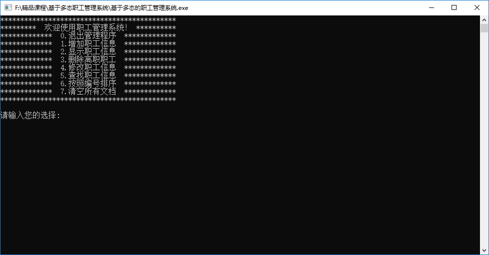

需根据用户不同的选择，完成不同的功能！


## 2、创建项目

创建项目步骤如下：

- 创建新项目
- 添加文件


### 2.1 创建项目

打开vs2017后，点击创建新项目，创建新的C++项目


填写项目名称以及项目路径，点击确定


### 2.2 添加文件

右键源文件，进行添加文件操作


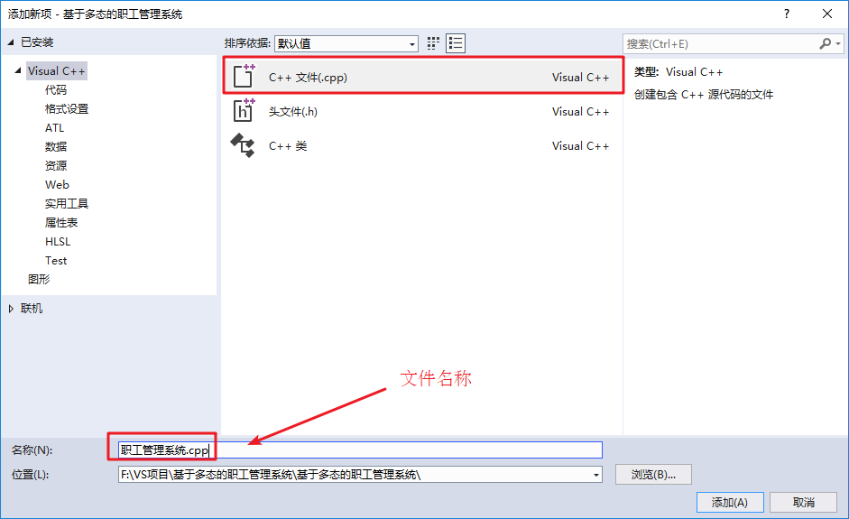


至此，项目已创建完毕


## 3、创建管理类

​	管理类负责的内容如下：

* 与用户的沟通菜单界面
* 对职工增删改查的操作
* 与文件的读写交互


### 3.1创建文件 

在头文件和源文件的文件夹下分别创建workerManager.h 和 workerManager.cpp文件


### 3.2 头文件实现

在workerManager.h中设计管理类

代码如下：

```C++
#pragma once
#include<iostream>
using namespace std;


class WorkerManager
{
public:

	//构造函数
	WorkerManager();

	//析构函数
	~WorkerManager();

};
```

### 3.3 源文件实现

在workerManager.cpp中将构造和析构函数空实现补全

```C++
#include "workerManager.h"

WorkerManager::WorkerManager()
{
}

WorkerManager::~WorkerManager()
{
}
```


至此职工管理类以创建完毕


## 4、菜单功能

功能描述：与用户的沟通界面

### 4.1 添加成员函数

在管理类workerManager.h中添加成员函数  `void Show_Menu();`

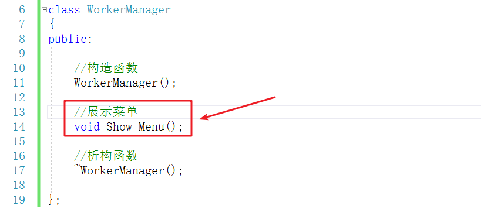

 


### 4.2 菜单功能实现

在管理类workerManager.cpp中实现  Show_Menu()函数

```C++
void WorkerManager::Show_Menu()
{
	cout << "********************************************" << endl;
	cout << "*********  欢迎使用职工管理系统！ **********" << endl;
	cout << "*************  0.退出管理程序  *************" << endl;
	cout << "*************  1.增加职工信息  *************" << endl;
	cout << "*************  2.显示职工信息  *************" << endl;
	cout << "*************  3.删除离职职工  *************" << endl;
	cout << "*************  4.修改职工信息  *************" << endl;
	cout << "*************  5.查找职工信息  *************" << endl;
	cout << "*************  6.按照编号排序  *************" << endl;
	cout << "*************  7.清空所有文档  *************" << endl;
	cout << "********************************************" << endl;
	cout << endl;
}
```


### 4.3 测试菜单功能

在职工管理系统.cpp中测试菜单功能

代码：

```C++
#include<iostream>
#include "workerManager.h"
using namespace std;

int main() {

	WorkerManager wm;

	wm.Show_Menu();

	system("pause");

	return 0;
}
```

运行效果如图：


## 5、退出功能

### 5.1  提供功能接口

在main函数中提供分支选择，提供每个功能接口

代码：

```C++
int main() {

	WorkerManager wm;
	int choice = 0;
	while (true)
	{
		//展示菜单
		wm.Show_Menu();
		cout << "请输入您的选择:" << endl;
		cin >> choice;

		switch (choice)
		{
		case 0: //退出系统
			break;
		case 1: //添加职工
			break;
		case 2: //显示职工
			break;
		case 3: //删除职工
			break;
		case 4: //修改职工
			break;
		case 5: //查找职工
			break;
		case 6: //排序职工
			break;
		case 7: //清空文件
			break;
		default:
			system("cls");
			break;
		}
	}

	system("pause");
	return 0;
}
```


### 5.2 实现退出功能

在workerManager.h中提供退出系统的成员函数 `	void exitSystem();`

在workerManager.cpp中提供具体的功能实现

```C++
void WorkerManager::exitSystem()
{
	cout << "欢迎下次使用" << endl;
	system("pause");
	exit(0);
}
```


### 5.3测试功能

在main函数分支 0  选项中，调用退出程序的接口

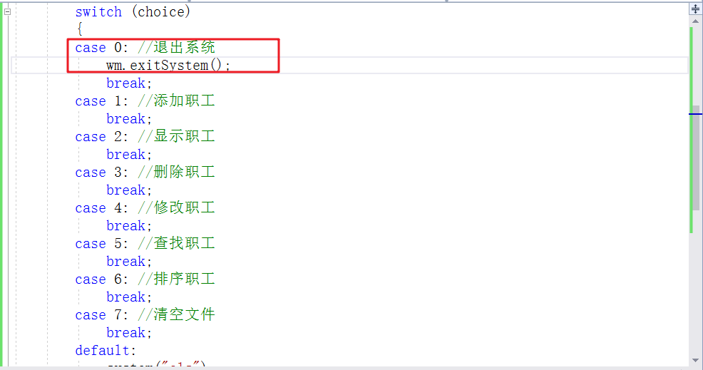


运行测试效果如图：


## 6、创建职工类

### 6.1 创建职工抽象类

职工的分类为：普通员工、经理、老板

将三种职工抽象到一个类（worker）中,利用多态管理不同职工种类

职工的属性为：职工编号、职工姓名、职工所在部门编号

职工的行为为：岗位职责信息描述，获取岗位名称


头文件文件夹下  创建文件worker.h  文件并且添加如下代码：

```C++
#pragma once
#include<iostream>
#include<string>
using namespace std;

//职工抽象基类
class Worker
{
public:

	//显示个人信息
	virtual void showInfo() = 0;
	//获取岗位名称
	virtual string getDeptName() = 0;

	int m_Id; //职工编号
	string m_Name; //职工姓名
	int m_DeptId; //职工所在部门名称编号
};
```


### 6.2 创建普通员工类

普通员工类**继承**职工抽象类，并重写父类中纯虚函数

在头文件和源文件的文件夹下分别创建employee.h 和 employee.cpp文件


employee.h中代码如下：

```C++
#pragma once 
#include<iostream>
using namespace std;
#include "worker.h"

//员工类
class Employee :public Worker
{
public:

	//构造函数
	Employee(int id, string name, int dId);

	//显示个人信息
	virtual void showInfo();

	//获取职工岗位名称
	virtual string getDeptName();
};
```

employee.cpp中代码如下：

```C++
#include "employee.h"

Employee::Employee(int id, string name, int dId)
{
	this->m_Id = id;
	this->m_Name = name;
	this->m_DeptId = dId;
}

void Employee::showInfo()
{
	cout << "职工编号： " << this->m_Id
		<< " \t职工姓名： " << this->m_Name
		<< " \t岗位：" << this->getDeptName()
		<< " \t岗位职责：完成经理交给的任务" << endl;
}


string Employee::getDeptName()
{
	return string("员工");
}


```


### 6.3 创建经理类

经理类**继承**职工抽象类，并重写父类中纯虚函数，和普通员工类似

在头文件和源文件的文件夹下分别创建manager.h 和 manager.cpp文件


manager.h中代码如下：

```c++
#pragma once
#include<iostream>
using namespace std;
#include "worker.h"

//经理类
class Manager :public Worker
{
public:

	Manager(int id, string name, int dId);

	//显示个人信息
	virtual void showInfo();

	//获取职工岗位名称
	virtual string getDeptName();
};
```

manager.cpp中代码如下：

```c++
#include "manager.h"

Manager::Manager(int id, string name, int dId)
{
	this->m_Id = id;
	this->m_Name = name;
	this->m_DeptId = dId;

}

void Manager::showInfo()
{
	cout << "职工编号： " << this->m_Id
		<< " \t职工姓名： " << this->m_Name
		<< " \t岗位：" << this->getDeptName()
		<< " \t岗位职责：完成老板交给的任务,并下发任务给员工" << endl;
}

string Manager::getDeptName()
{
	return string("经理");
}


```


### 6.4 创建老板类

老板类**继承**职工抽象类，并重写父类中纯虚函数，和普通员工类似

在头文件和源文件的文件夹下分别创建boss.h 和 boss.cpp文件


boss.h中代码如下：

```c++
#pragma once
#include<iostream>
using namespace std;
#include "worker.h"

//老板类
class Boss :public Worker
{
public:

	Boss(int id, string name, int dId);

	//显示个人信息
	virtual void showInfo();

	//获取职工岗位名称
	virtual string getDeptName();
};
```

boss.cpp中代码如下：

```c++
#include "boss.h"

Boss::Boss(int id, string name, int dId)
{
	this->m_Id = id;
	this->m_Name = name;
	this->m_DeptId = dId;

}

void Boss::showInfo()
{
	cout << "职工编号： " << this->m_Id
		<< " \t职工姓名： " << this->m_Name
		<< " \t岗位：" << this->getDeptName()
		<< " \t岗位职责：管理公司所有事务" << endl;
}

string Boss::getDeptName()
{
	return string("总裁");
}

```


### 6.5 测试多态

在职工管理系统.cpp中添加测试函数，并且运行能够产生多态


测试代码如下：

```C++
#include "worker.h"
#include "employee.h"
#include "manager.h"
#include "boss.h"


void test()
{
	Worker * worker = NULL;
	worker = new Employee(1, "张三", 1);
	worker->showInfo();
	delete worker;
	
	worker = new Manager(2, "李四", 2);
	worker->showInfo();
	delete worker;

	worker = new Boss(3, "王五", 3);
	worker->showInfo();
	delete worker;
}

```


运行效果如图：


测试成功后，测试代码可以注释保留，或者选择删除


## 7、添加职工

功能描述：批量添加职工，并且保存到文件中

### 7.1 功能分析

分析：

用户在批量创建时，可能会创建不同种类的职工

如果想将所有不同种类的员工都放入到一个数组中，可以将所有员工的指针维护到一个数组里

如果想在程序中维护这个不定长度的数组，可以将数组创建到堆区，并利用Worker **的指针维护


### 7.2 功能实现

在WokerManager.h头文件中添加成员属性 代码：

```C++
	//记录文件中的人数个数
	int m_EmpNum;

	//员工数组的指针
	Worker ** m_EmpArray;
```


在WorkerManager构造函数中初始化属性

```C++
WorkerManager::WorkerManager()
{
	//初始化人数
	this->m_EmpNum = 0;

	//初始化数组指针
	this->m_EmpArray = NULL;
}
```


在workerManager.h中添加成员函数

```C++
	//增加职工
	void Add_Emp();
```


workerManager.cpp中实现该函数

```C++
//增加职工
void WorkerManager::Add_Emp()
{
	cout << "请输入增加职工数量： " << endl;

	int addNum = 0;
	cin >> addNum;

	if (addNum > 0)
	{
		//计算新空间大小
		int newSize = this->m_EmpNum + addNum;

		//开辟新空间
		Worker ** newSpace = new Worker*[newSize];

		//将原空间下内容存放到新空间下
		if (this->m_EmpArray != NULL)
		{
			for (int i = 0; i < this->m_EmpNum; i++)
			{
				newSpace[i] = this->m_EmpArray[i];
			}
		}

		//输入新数据
		for (int i = 0; i < addNum; i++)
		{
			int id;
			string name;
			int dSelect;

			cout << "请输入第 " << i + 1 << " 个新职工编号：" << endl;
			cin >> id;


			cout << "请输入第 " << i + 1 << " 个新职工姓名：" << endl;
			cin >> name;


			cout << "请选择该职工的岗位：" << endl;
			cout << "1、普通职工" << endl;
			cout << "2、经理" << endl;
			cout << "3、老板" << endl;
			cin >> dSelect;


			Worker * worker = NULL;
			switch (dSelect)
			{
			case 1: //普通员工
				worker = new Employee(id, name, 1);
				break;
			case 2: //经理
				worker = new Manager(id, name, 2);
				break;
			case 3:  //老板
				worker = new Boss(id, name, 3);
				break;
			default:
				break;
			}


			newSpace[this->m_EmpNum + i] = worker;
		}

		//释放原有空间
		delete[] this->m_EmpArray;

		//更改新空间的指向
		this->m_EmpArray = newSpace;

		//更新新的个数
		this->m_EmpNum = newSize;

		//提示信息
		cout << "成功添加" << addNum << "名新职工！" << endl;
	}
	else
	{
		cout << "输入有误" << endl;
	}

	system("pause");
	system("cls");
}
```


在WorkerManager.cpp的析构函数中，释放堆区数据

```C++
WorkerManager::~WorkerManager()
{
	if (this->m_EmpArray != NULL)
	{
		delete[] this->m_EmpArray;
	}
}

```


### 7.3 测试添加

在main函数分支 1  选项中，调用添加职工接口

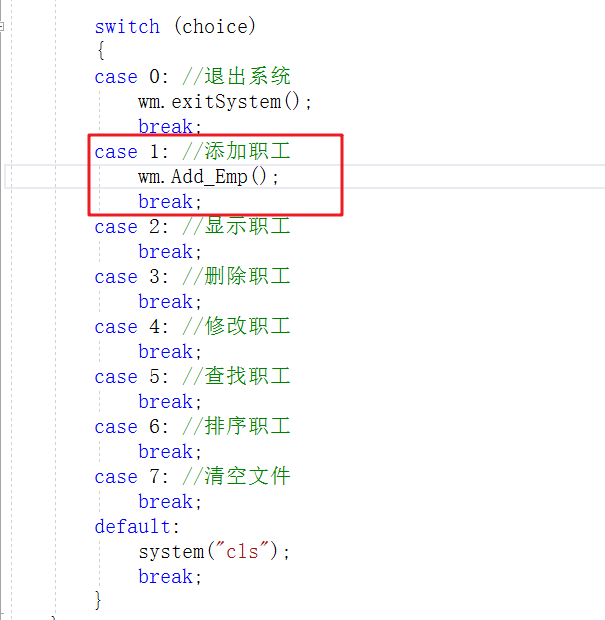

效果如图：


至此，添加职工到程序中功能实现完毕


## 8、文件交互 - 写文件

功能描述：对文件进行读写

​	在上一个添加功能中，我们只是将所有的数据添加到了内存中，一旦程序结束就无法保存了

​	因此文件管理类中需要一个与文件进行交互的功能，对于文件进行读写操作


### 8.1 设定文件路径

首先我们将文件路径，在workerManager.h中添加宏常量,并且包含头文件 fstream

```C++
#include <fstream>
#define  FILENAME "empFile.txt"
```


### 8.2 成员函数声明

在workerManager.h中类里添加成员函数 `void save()`

```C++
//保存文件
void save();
```


### 8.3 保存文件功能实现

```C++
void WorkerManager::save()
{
	ofstream ofs;
	ofs.open(FILENAME, ios::out);


	for (int i = 0; i < this->m_EmpNum; i++)
	{
		ofs << this->m_EmpArray[i]->m_Id << " " 
			<< this->m_EmpArray[i]->m_Name << " " 
			<< this->m_EmpArray[i]->m_DeptId << endl;
	}

	ofs.close();
}
```


### 8.4 保存文件功能测试

在添加职工功能中添加成功后添加保存文件函数


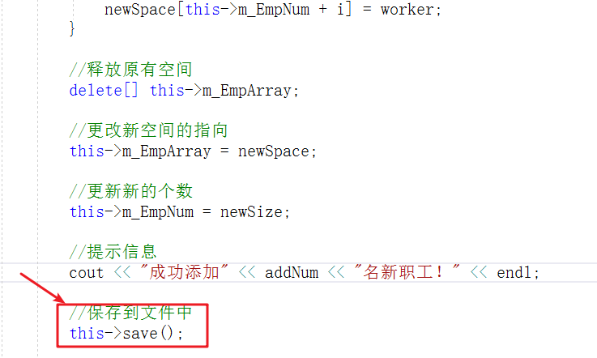


再次运行代码，添加职工


同级目录下多出文件，并且保存了添加的信息


## 9、文件交互 - 读文件

功能描述：将文件中的内容读取到程序中

虽然我们实现了添加职工后保存到文件的操作，但是每次开始运行程序，并没有将文件中数据读取到程序中

而我们的程序功能中还有清空文件的需求

因此构造函数初始化数据的情况分为三种


1. 第一次使用，文件未创建
2. 文件存在，但是数据被用户清空
3. 文件存在，并且保存职工的所有数据


### 9.1 文件未创建

在workerManager.h中添加新的成员属性 m_FileIsEmpty标志文件是否为空

```C++
	//标志文件是否为空
	bool m_FileIsEmpty;
```


修改WorkerManager.cpp中构造函数代码

```C++
WorkerManager::WorkerManager()
{
	ifstream ifs;
	ifs.open(FILENAME, ios::in);

	//文件不存在情况
	if (!ifs.is_open())
	{
		cout << "文件不存在" << endl; //测试输出
		this->m_EmpNum = 0;  //初始化人数
		this->m_FileIsEmpty = true; //初始化文件为空标志
		this->m_EmpArray = NULL; //初始化数组
		ifs.close(); //关闭文件
		return;
	}
}
```


删除文件后，测试文件不存在时初始化数据功能


### 9.2 文件存在且数据为空

在workerManager.cpp中的构造函数追加代码：

```C++
	//文件存在，并且没有记录
	char ch;
	ifs >> ch;
	if (ifs.eof())
	{
		cout << "文件为空!" << endl;
		this->m_EmpNum = 0;
		this->m_FileIsEmpty = true;
		this->m_EmpArray = NULL;
		ifs.close();
		return;
	}
```

追加代码位置如图：

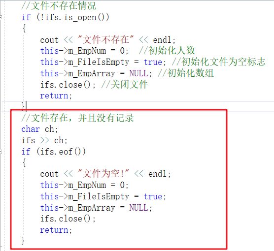

将文件创建后清空文件内容，并测试该情况下初始化功能


我们发现文件不存在或者为空清空 m_FileIsEmpty 判断文件是否为空的标志都为真，那何时为假？

成功添加职工后，应该更改文件不为空的标志

在`void WorkerManager::Add_Emp() `成员函数中添加：

```C++
		//更新职工不为空标志
		this->m_FileIsEmpty = false;
```

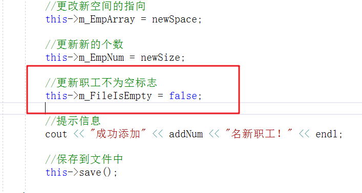


### 9.3 文件存在且保存职工数据

#### 9.3.1 获取记录的职工人数

在workerManager.h中添加成员函数 ` int get_EmpNum();`

```C++
	//统计人数
	int get_EmpNum();
```

workerManager.cpp中实现

```C++
int WorkerManager::get_EmpNum()
{
	ifstream ifs;
	ifs.open(FILENAME, ios::in);

	int id;
	string name;
	int dId;

	int num = 0;

	while (ifs >> id && ifs >> name && ifs >> dId)
	{
        //记录人数
		num++;
	}
	ifs.close();

	return num;
}
```

在workerManager.cpp构造函数中继续追加代码：

```C++
	int num =  this->get_EmpNum();
	cout << "职工个数为：" << num << endl;  //测试代码
	this->m_EmpNum = num;  //更新成员属性 
```


手动添加一些职工数据，测试获取职工数量函数


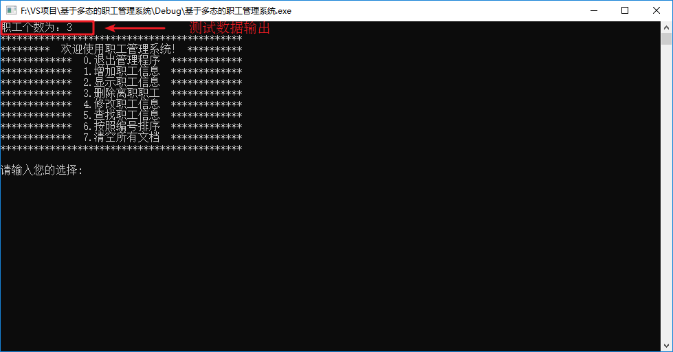


#### 9.3.2 初始化数组

根据职工的数据以及职工数据，初始化workerManager中的Worker ** m_EmpArray 指针


在WorkerManager.h中添加成员函数  `void init_Emp();`

```C++
	//初始化员工
	void init_Emp();
```


在WorkerManager.cpp中实现

```C++
void WorkerManager::init_Emp()
{
	ifstream ifs;
	ifs.open(FILENAME, ios::in);

	int id;
	string name;
	int dId;
	
	int index = 0;
	while (ifs >> id && ifs >> name && ifs >> dId)
	{
		Worker * worker = NULL;
		//根据不同的部门Id创建不同对象
		if (dId == 1)  // 1普通员工
		{
			worker = new Employee(id, name, dId);
		}
		else if (dId == 2) //2经理
		{
			worker = new Manager(id, name, dId);
		}
		else //总裁
		{
			worker = new Boss(id, name, dId);
		}
		//存放在数组中
		this->m_EmpArray[index] = worker;
		index++;
	}
}
```


在workerManager.cpp构造函数中追加代码

```C++
	//根据职工数创建数组
	this->m_EmpArray = new Worker *[this->m_EmpNum];
	//初始化职工
	init_Emp();

	//测试代码
	for (int i = 0; i < m_EmpNum; i++)
	{
		cout << "职工号： " << this->m_EmpArray[i]->m_Id
			<< " 职工姓名： " << this->m_EmpArray[i]->m_Name
			<< " 部门编号： " << this->m_EmpArray[i]->m_DeptId << endl;
	}
```


运行程序，测试从文件中获取的数据

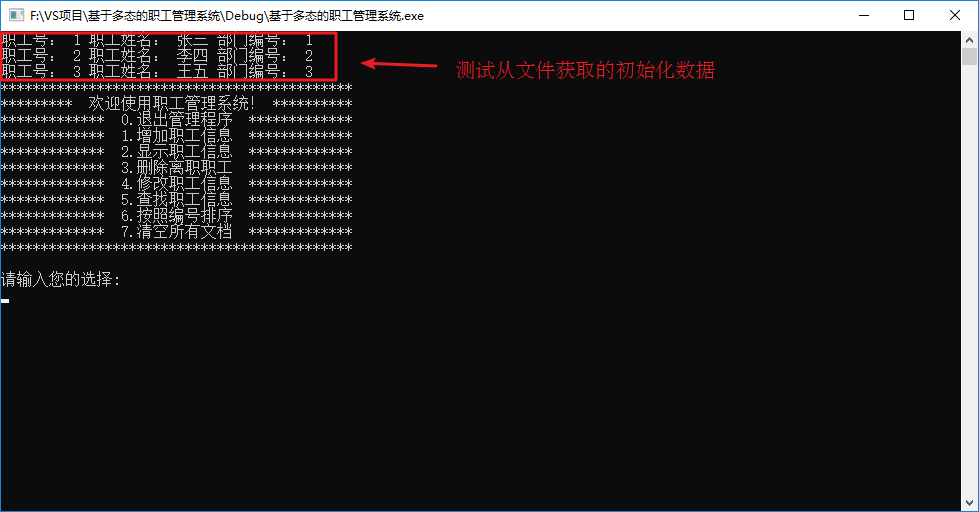

至此初始化数据功能完毕，测试代码可以注释或删除掉！


## 10、显示职工

功能描述：显示当前所有职工信息

#### 10.1 显示职工函数声明

在workerManager.h中添加成员函数  `void Show_Emp();`

```C++
	//显示职工
	void Show_Emp();
```


#### 10.2 显示职工函数实现

在workerManager.cpp中实现成员函数 `void Show_Emp();`

```C++
//显示职工
void WorkerManager::Show_Emp()
{
	if (this->m_FileIsEmpty)
	{
		cout << "文件不存在或记录为空！" << endl;
	}
	else
	{
		for (int i = 0; i < m_EmpNum; i++)
		{
			//利用多态调用接口
			this->m_EmpArray[i]->showInfo();
		}
	}

	system("pause");
	system("cls");
}
```


#### 10.3 测试显示职工

在main函数分支 2  选项中，调用显示职工接口

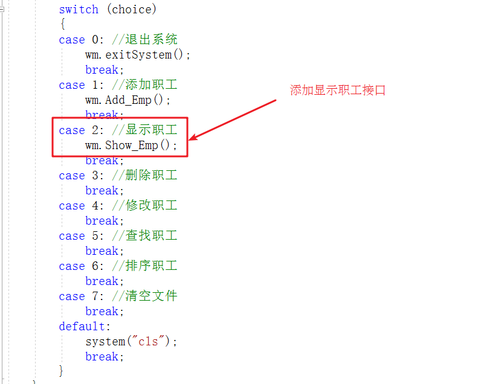


测试时分别测试 文件为空和文件不为空两种情况

测试效果：

测试1-文件不存在或者为空情况


测试2 - 文件存在且有记录情况


测试完毕，至此，显示所有职工信息功能实现


## 11、删除职工

功能描述：按照职工的编号进行删除职工操作


#### 11.1 删除职工函数声明

在workerManager.h中添加成员函数  `void Del_Emp();`

```C++
	//删除职工
	void Del_Emp();
```


#### 11.2 职工是否存在函数声明

很多功能都需要用到根据职工是否存在来进行操作如：删除职工、修改职工、查找职工

因此添加该公告函数，以便后续调用

在workerManager.h中添加成员函数  `int IsExist(int id);`

```C++
	//按照职工编号判断职工是否存在,若存在返回职工在数组中位置，不存在返回-1
	int IsExist(int id);
```


#### 11.3 职工是否存在函数实现

在workerManager.cpp中实现成员函数 `int IsExist(int id);`

```C++
int WorkerManager::IsExist(int id)
{
	int index = -1;

	for (int i = 0; i < this->m_EmpNum; i++)
	{
		if (this->m_EmpArray[i]->m_Id == id)
		{
			index = i;

			break;
		}
	}

	return index;
}
```


#### 11.4 删除职工函数实现

在workerManager.cpp中实现成员函数 ` void Del_Emp();`

```C++
//删除职工
void WorkerManager::Del_Emp()
{
	if (this->m_FileIsEmpty)
	{
		cout << "文件不存在或记录为空！" << endl;
	}
	else
	{
		//按职工编号删除
		cout << "请输入想要删除的职工号：" << endl;
		int id = 0;
		cin >> id;

		int index = this->IsExist(id);

		if (index != -1)  //说明index上位置数据需要删除
		{
			for (int i = index; i < this->m_EmpNum - 1; i++)
			{
				this->m_EmpArray[i] = this->m_EmpArray[i + 1];
			}
			this->m_EmpNum--;

			this->save(); //删除后数据同步到文件中
			cout << "删除成功！" << endl;
		}
		else
		{
			cout << "删除失败，未找到该职工" << endl;
		}
	}
	
	system("pause");
	system("cls");
}
```


#### 11.5 测试删除职工

在main函数分支 3  选项中，调用删除职工接口

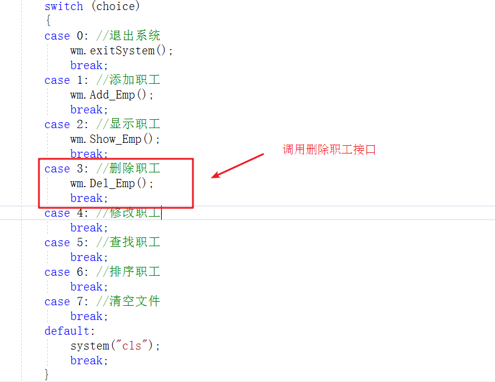

测试1 - 删除不存在职工情况

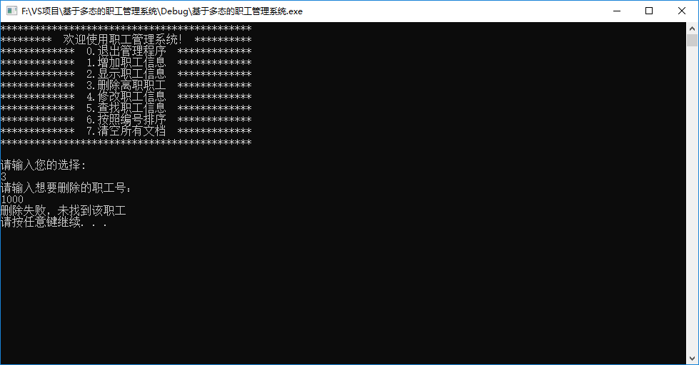

测试2 - 删除存在的职工情况

删除成功提示图：


再次显示所有职工信息，确保已经删除

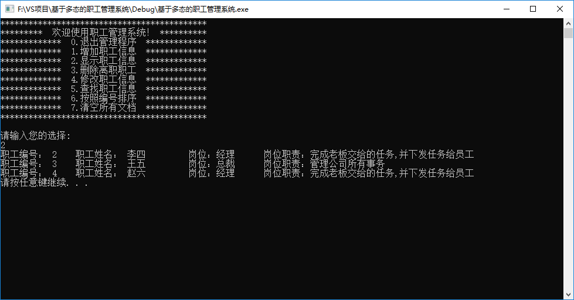

查看文件中信息，再次核实员工已被完全删除


至此，删除职工功能实现完毕！


## 12、修改职工

功能描述：能够按照职工的编号对职工信息进行修改并保存

#### 12.1 修改职工函数声明

在workerManager.h中添加成员函数  `void Mod_Emp();`

```C++
	//修改职工
	void Mod_Emp();
```


#### 12.2 修改职工函数实现

在workerManager.cpp中实现成员函数 ` void Mod_Emp();`

```C++
//修改职工
void WorkerManager::Mod_Emp()
{
	if (this->m_FileIsEmpty)
	{
		cout << "文件不存在或记录为空！" << endl;
	}
	else
	{
		cout << "请输入修改职工的编号：" << endl;
		int id;
		cin >> id;

		int ret = this->IsExist(id);
		if (ret != -1)
		{ 
			//查找到编号的职工

			delete this->m_EmpArray[ret];
			
			int newId = 0;
			string newName = "";
			int dSelect = 0;

			cout << "查到： " << id << "号职工，请输入新职工号： " << endl;
			cin >> newId;

			cout << "请输入新姓名： " << endl;
			cin >> newName;

			cout << "请输入岗位： " << endl;
			cout << "1、普通职工" << endl;
			cout << "2、经理" << endl;
			cout << "3、老板" << endl;
			cin >> dSelect;

			Worker * worker = NULL;
			switch (dSelect)
			{
			case1:
				worker = new Employee(newId, newName, dSelect);
				break;
			case2:
				worker = new Manager(newId, newName, dSelect);
				break;
			case 3:
				worker = new Boss(newId, newName, dSelect);
				break;
			default:
				break;
			}

			//更改数据 到数组中
			this->m_EmpArray[ret]= worker;
			
			cout << "修改成功！" << endl;

			//保存到文件中
			this->save();
		}
		else
		{
			cout << "修改失败，查无此人" << endl;
		}
	}

	//按任意键 清屏
	system("pause");
	system("cls");
}

```


#### 12.3 测试修改职工

在main函数分支 4  选项中，调用修改职工接口

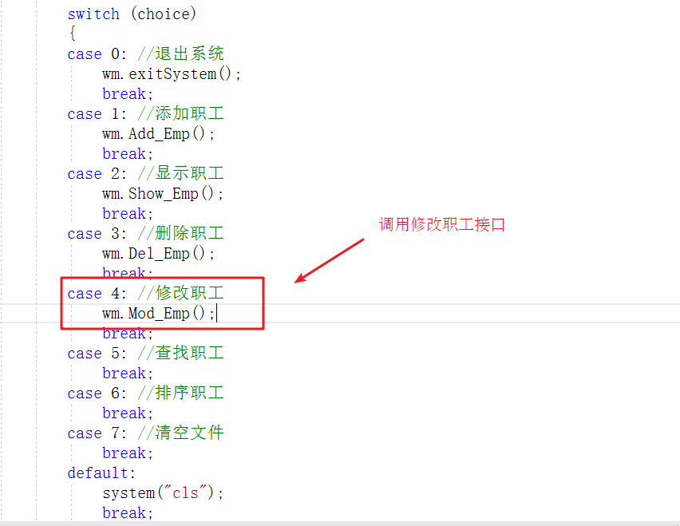


测试1 - 修改不存在职工情况

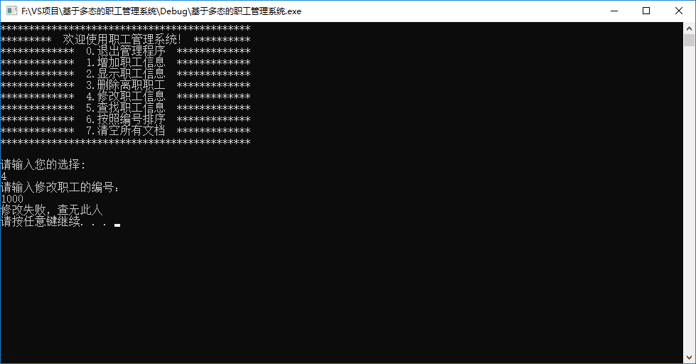

测试2 - 修改存在职工情况，例如将职工 "李四" 改为 "赵四"

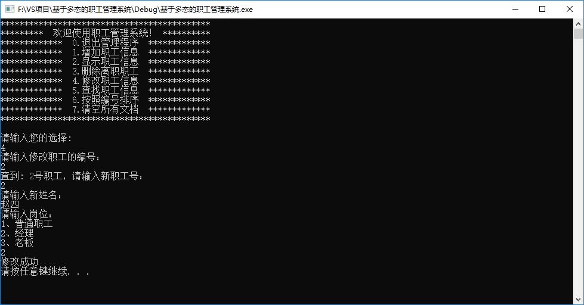

修改后再次查看所有职工信息，并确认修改成功


再次确认文件中信息也同步更新

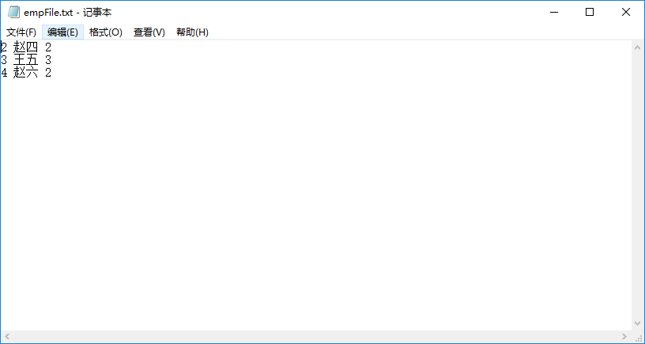

至此，修改职工功能已实现！


## 13、查找职工

功能描述：提供两种查找职工方式，一种按照职工编号，一种按照职工姓名

#### 13.1 查找职工函数声明

在workerManager.h中添加成员函数  `void Find_Emp();`

```c++
	//查找职工
	void Find_Emp();
```


#### 13.2 查找职工函数实现

在workerManager.cpp中实现成员函数 ` void Find_Emp();`

```C++
//查找职工
void WorkerManager::Find_Emp()
{
	if (this->m_FileIsEmpty)
	{
		cout << "文件不存在或记录为空！" << endl;
	}
	else
	{
		cout << "请输入查找的方式：" << endl;
		cout << "1、按职工编号查找" << endl;
		cout << "2、按姓名查找" << endl;

		int select = 0;
		cin >> select;


		if (select == 1) //按职工号查找
		{
			int id;
			cout << "请输入查找的职工编号：" << endl;
			cin >> id;

			int ret = IsExist(id);
			if (ret != -1)
			{
				cout << "查找成功！该职工信息如下：" << endl;
				this->m_EmpArray[ret]->showInfo();
			}
			else
			{
				cout << "查找失败，查无此人" << endl;
			}
		}
		else if(select == 2) //按姓名查找
		{
			string name;
			cout << "请输入查找的姓名：" << endl;
			cin >> name;

			bool flag = false;  //查找到的标志
			for (int i = 0; i < m_EmpNum; i++)
			{
				if (m_EmpArray[i]->m_Name == name)
				{
					cout << "查找成功,职工编号为："
                           << m_EmpArray[i]->m_Id
                           << " 号的信息如下：" << endl;
					
					flag = true;

					this->m_EmpArray[i]->showInfo();
				}
			}
			if (flag == false)
			{
				//查无此人
				cout << "查找失败，查无此人" << endl;
			}
		}
		else
		{
			cout << "输入选项有误" << endl;
		}
	}


	system("pause");
	system("cls");
}
```


#### 13.3 测试查找职工

在main函数分支 5  选项中，调用查找职工接口

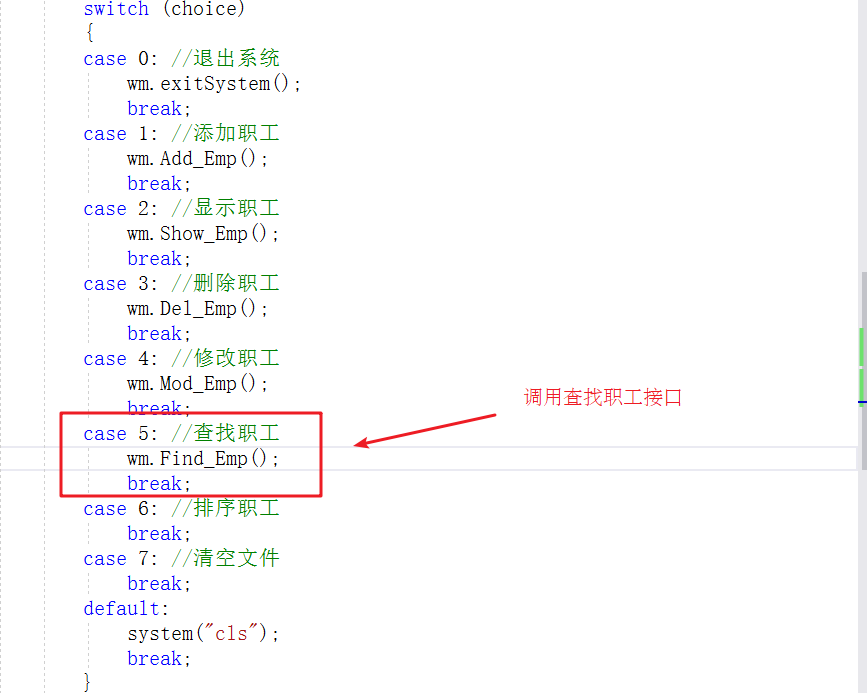

测试1 - 按照职工编号查找 - 查找不存在职工


测试2 - 按照职工编号查找 -  查找存在职工

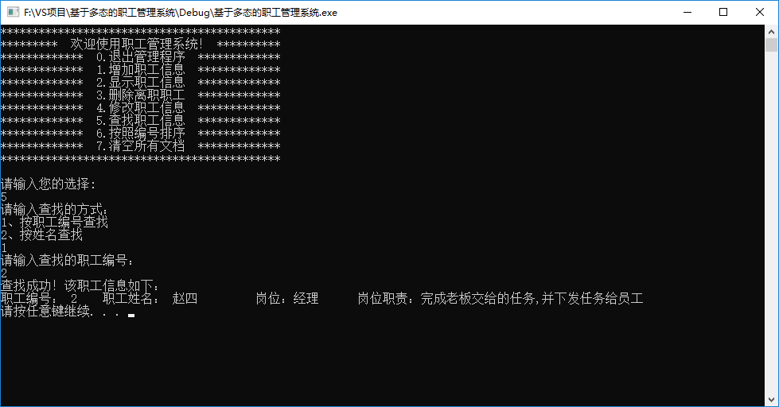

测试3 - 按照职工姓名查找 - 查找不存在职工


测试4 - 按照职工姓名查找 - 查找存在职工（如果出现重名，也一并显示，在文件中可以添加重名职工）

例如 添加两个王五的职工，然后按照姓名查找王五


至此，查找职工功能实现完毕！


## 14、排序

功能描述：按照职工编号进行排序，排序的顺序由用户指定

#### 14.1 排序函数声明

在workerManager.h中添加成员函数  `void Sort_Emp();`

```C++
	//排序职工
	void Sort_Emp();
```


#### 14.2 排序函数实现

在workerManager.cpp中实现成员函数 ` void Sort_Emp();`

```C++
//排序职工
void WorkerManager::Sort_Emp()
{
	if (this->m_FileIsEmpty)
	{
		cout << "文件不存在或记录为空！" << endl;
		system("pause");
		system("cls");
	}
	else
	{
		cout << "请选择排序方式： " << endl;
		cout << "1、按职工号进行升序" << endl;
		cout << "2、按职工号进行降序" << endl;

		int select = 0;
		cin >> select;


		for (int i = 0; i < m_EmpNum; i++)
		{
			int minOrMax = i;
			for (int j = i + 1; j < m_EmpNum; j++)
			{
				if (select == 1) //升序
				{
					if (m_EmpArray[minOrMax]->m_Id > m_EmpArray[j]->m_Id)
					{
						minOrMax = j;
					}
				}
				else  //降序
				{
					if (m_EmpArray[minOrMax]->m_Id < m_EmpArray[j]->m_Id)
					{
						minOrMax = j;
					}
				}
			}

			if (i != minOrMax)
			{
				Worker * temp = m_EmpArray[i];
				m_EmpArray[i] = m_EmpArray[minOrMax];
				m_EmpArray[minOrMax] = temp;
			}

		}

		cout << "排序成功,排序后结果为：" << endl;
		this->save();
		this->Show_Emp();
	}

}
```


#### 14.3 测试排序功能

在main函数分支 6  选项中，调用排序职工接口


测试：

首先我们添加一些职工，序号是无序的，例如：

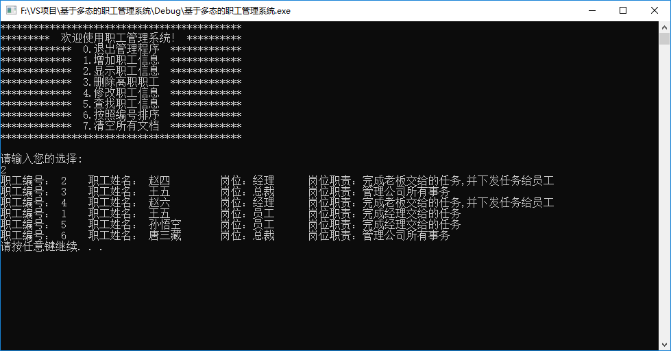


测试 - 升序排序


文件同步更新

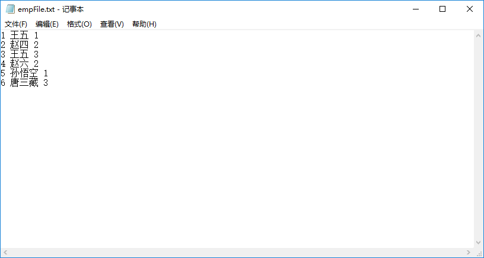


测试 - 降序排序


文件同步更新

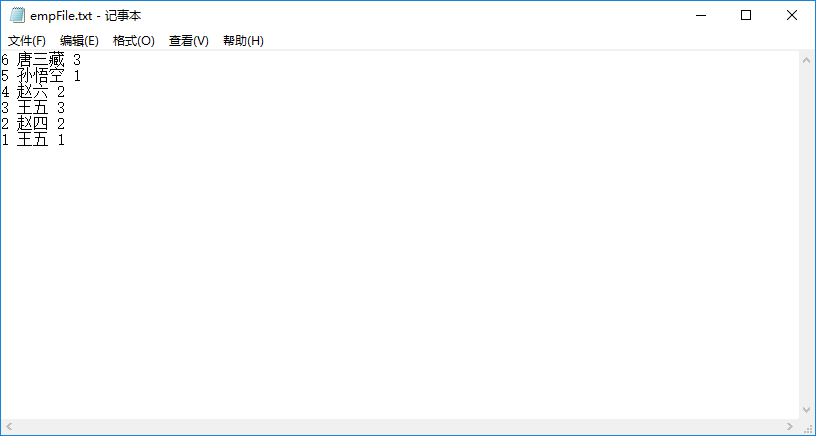

至此，职工按照编号排序的功能实现完毕！


## 15、清空文件

功能描述：将文件中记录数据清空


#### 15.1 清空函数声明

在workerManager.h中添加成员函数  `void Clean_File();`

```C++
	//清空文件
	void Clean_File();
```


#### 15.2 清空函数实现

在workerManager.cpp中实现员函数 ` void Clean_File();`

```C++
//清空文件
void WorkerManager::Clean_File()
{
	cout << "确认清空？" << endl;
	cout << "1、确认" << endl;
	cout << "2、返回" << endl;

	int select = 0;
	cin >> select;

	if (select == 1)
	{
		//打开模式 ios::trunc 如果存在删除文件并重新创建
		ofstream ofs(FILENAME, ios::trunc);
		ofs.close();

		if (this->m_EmpArray != NULL)
		{
            for (int i = 0; i < this->m_EmpNum; i++)
			{
				if (this->m_EmpArray[i] != NULL)
				{
					delete this->m_EmpArray[i];
				}
			}
			this->m_EmpNum = 0;
			delete[] this->m_EmpArray;
			this->m_EmpArray = NULL;
			this->m_FileIsEmpty = true;
		}
		cout << "清空成功！" << endl;
	}

	system("pause");
	system("cls");
}
```


#### 15.3 测试清空文件

在main函数分支 7  选项中，调用清空文件接口


测试：确认清空文件


再次查看文件中数据，记录已为空

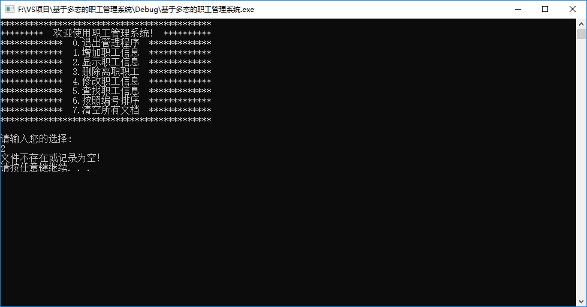

打开文件，里面数据已确保清空，该功能需要慎用！


随着清空文件功能实现，本案例制作完毕  ^ _ ^  